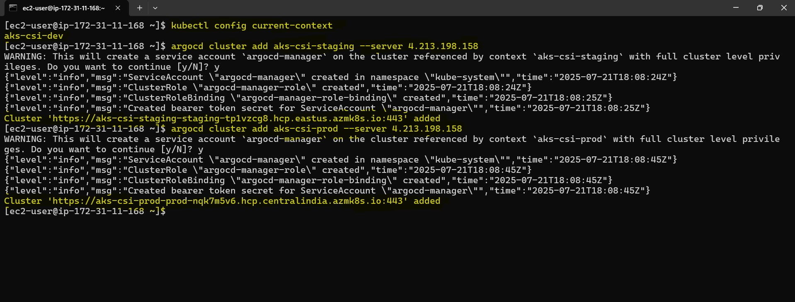

# Configure ArgoCD (Hub-and-Spoke) Model, Argo Rollouts on Azure AKS Clusters

## 📘 Overview

This documentation outlines the step-by-step process of implementing a **Hub-and-Spoke architecture using ArgoCD** and integrating **Argo Rollouts** across multiple Azure Kubernetes Service (AKS) clusters. The objective is to centralize GitOps-based deployment management, streamline cluster operations, and enable progressive delivery using a clean and scalable model.

The configuration described herein uses four AKS clusters representing different deployment stages:

* `dev` (serves as the hub)
* `qa` (spoke)
* `staging` (spoke)
* `prod` (spoke)

ArgoCD is deployed exclusively in the `dev` cluster to manage the remaining clusters remotely, while Argo Rollouts is installed in all clusters to support advanced deployment strategies like Canary and Blue-Green deployments.

The core objective of this configuration was to:

* **Centralize cluster management** using a single ArgoCD instance.
* **Optimize resource utilization** by avoiding redundant control planes in each cluster.
* **Enable progressive delivery** using Argo Rollouts across all environments.
* **Follow cloud-native best practices** for scalability, flexibility, and observability.


---

## Architecture Overview

The architecture follows a **Hub-and-Spoke model**:

* The `dev` cluster acts as the **hub**. It hosts the ArgoCD control plane (`argocd-server`, `repo-server`, `application-controller`, etc.).
* The `qa`, `staging`, and `prod` clusters act as **spokes**. They are registered as **external managed clusters** within ArgoCD.
* Each cluster, including the `dev`, has **Argo Rollouts installed independently**, enabling features like **Canary deployments** and **Blue-Green rollouts**.

This topology allows centralized GitOps control and maintains **operational simplicity** while supporting environment isolation.

---
## Prerequisites

Before getting started, I ensured that both the infrastructure and local tooling were ready. This saved me a lot of time during the actual setup process.

### Infrastructure

I had already provisioned the four required AKS clusters, one for each environment. These were:

* `aks-csi-dev`: This is the central cluster where I installed ArgoCD. It serves as the control plane.
* `aks-csi-qa`: This cluster is used for testing features before staging.
* `aks-csi-staging`: A replica of the production environment used for final validation.
* `aks-csi-prod`: The live production environment.

### Local Tools Installed

I ensured the following CLI tools were installed and configured on my local machine. These are essential for interacting with AKS clusters and ArgoCD:

* **Azure CLI (`az`)**: Used to authenticate and retrieve AKS credentials.
* **kubectl**: Required to interact with Kubernetes clusters.
* **argocd CLI**: Helps with scripting and cluster registration tasks.
* **Helm**: Used to install and manage Kubernetes applications like ArgoCD and Argo Rollouts.


### Authenticating Clusters Locally

To make context switching easier and enable seamless access, I authenticated each cluster and merged their kubeconfigs into my local configuration. Here's how I did it:

```bash
az aks get-credentials --resource-group rg-csi-dev --name aks-csi-dev
az aks get-credentials --resource-group rg-csi-staging --name aks-csi-staging
az aks get-credentials --resource-group rg-csi-prod --name aks-csi-prod
```

Running the above commands added each cluster's context to my local `kubeconfig` file, making it easier to switch between them later.


---

## Step 1: Installing ArgoCD on `dev` Cluster (Hub)

The `aks-csi-dev` cluster acts as the central hub, so I installed ArgoCD here. This is where all applications across environments will be registered and controlled.

### Step 1.1: Switch to the `aks-csi-dev` Context

Before performing any actions, I confirmed that my kubectl context was set to `aks-csi-dev`. This ensures all commands run against the correct cluster.

```bash
kubectl config use-context aks-csi-dev
```

This is an important step to avoid applying configurations on the wrong cluster.


### Step 1.2: Create Namespace for ArgoCD

To maintain clean separation and manage access easily, I created a dedicated namespace for ArgoCD. This keeps the system components logically grouped and prevents conflicts with other workloads.

```bash
kubectl create namespace argocd
```

After running the command, I confirmed the namespace was created successfully.


### Step 1.3: Install ArgoCD using Helm

I chose Helm for installation to simplify configuration and upgrade management. First, I added the Argo Helm chart repository and then installed ArgoCD with a LoadBalancer service so the UI could be accessed externally.

```bash
helm repo add argo https://argoproj.github.io/argo-helm
helm repo update

helm install argocd argo/argo-cd \
  --namespace argocd \
  --set server.service.type=LoadBalancer \
  --set dex.enabled=true
```

* `server.service.type=LoadBalancer` ensures the ArgoCD UI is publicly accessible.
* `dex.enabled=true` enables DEX for identity and SSO support.


I monitored the pods and waited for all components to be in a `Running` state.

### Step 1.4: Verify ArgoCD Installation

After the installation, I verified that all necessary pods were running as expected:

```bash
kubectl get pods -n argocd
```

All core components like `argocd-server`, `repo-server`, and `application-controller` came up fine.


### Step 1.5: Access ArgoCD Web UI

To log in, I retrieved the external IP of the LoadBalancer service:

```bash
kubectl get svc -n argocd
```

Then I fetched the default admin password using:

```bash
kubectl get secret argocd-initial-admin-secret -n argocd -o jsonpath="{.data.password}" | base64 -d
```

With these credentials, I accessed the ArgoCD UI using the LoadBalancer IP (e.g., `http://4.213.198.158:443`).


**Username:** `admin`
**Password:** (the decoded password)

### Step 1.6: Login via ArgoCD CLI (Recommended)

For ease of use and automation, I logged into ArgoCD using the CLI tool:

```bash
argocd login 4.213.198.158:443
```

This command helped verify connectivity and authentication via CLI. It may prompt a TLS warning if using self-signed certificates.


---

## Step 2: Registering External AKS Clusters as Managed Clusters

To allow ArgoCD to manage resources in other environments (`staging`, `qa`, and `prod`), I registered them as external clusters.

### Step 2.1: Switch Back to `dev` Context

Since cluster registration is managed from the control plane, I made sure my context was set to `aks-csi-dev`.

### Step 2.2: Register External Clusters to ArgoCD

Then, I added the staging and prod clusters:

```bash
argocd cluster add aks-csi-staging
argocd cluster add aks-csi-prod
```

These commands triggered permission prompts that I confirmed. Afterward, ArgoCD was able to connect and interact with these clusters.



I also verified the connections in the ArgoCD web UI under **Settings > Clusters**.


---

## Step 3: Installing Argo Rollouts in All Clusters

Since Argo Rollouts must run inside the target cluster to manage progressive delivery strategies, I installed it on **all four clusters**.

I used the following command on each cluster:

```bash

kubectl create namespace argo-rollouts
kubectl apply -n argo-rollouts -f https://github.com/argoproj/argo-rollouts/releases/latest/download/install.yaml
```

I repeated this for `dev`, `qa`, `staging`, and `prod` clusters.

Once installed, I ensured the controller pod was running:

```bash
kubectl get pods -n argo-rollouts
```


---

## References

* [ArgoCD Cluster Management Docs](https://argo-cd.readthedocs.io/en/stable/operator-manual/cluster-bootstrapping/)
* [Argo Rollouts Installation Guide](https://argo-rollouts.readthedocs.io/en/stable/getting-started/)

---

## Conclusion

In this setup, we implemented a Hub-and-Spoke model using ArgoCD and Argo Rollouts across four AKS clusters, centralizing management in the dev cluster while managing deployments in qa, staging, and prod. 

---